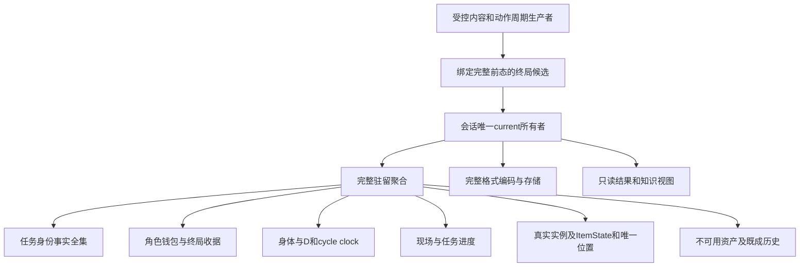

# 唯一所有权、关闭态与恢复合同候选

**DESIGN DRAFT，待正式采纳；不是现存v1能力。** 所有权图描述生产候选；有限模型的扁平JSON只是证明夹具，不是建议照抄的Schema。

## 唯一所有权

| 数据 | 唯一权威及引用关系 | 禁止第二真相 |
| --- | --- | --- |
| 根角色、rules/config身份、revision | 会话聚合根；所有子快照逐项相等 | 请求不选择另一角色、配置或自报新revision |
| declaration全集及任务unaccepted/active/closed | 既有mission-lifecycle值，角色＋具体commission唯一 | 收据的结果须等于事实，不能独立决定能否再接；标题不是身份 |
| 钱包 | 角色单一balance；本次收据只记before/income/penalty/after用于一致性与显示 | 不新建奖励副钱包、预留资金池、监听补款或恢复时再入账 |
| body、D/T、额度 | character-cycle现有body与clock，现场只引用同快照 | 不建立第二精力；ready/due来源引用最新合法关闭；死亡不伪装living clock |
| 现场、目标进度与到达 | residence-location受控提案＋任务内容生产者 | 命令不能带完成事实；关闭后只保留历史，不可导航、搜刮、整备后续做 |
| 物品／资源／归属 | 现有ItemInstance、ItemState及容器归属；处置记录引用实例 | 不以数量总账替换真实物；同实例不能同时在背包、地面、交付处 |
| 已交付、安装、消费、毁失 | 既成历史和处置位置；不可用资产保留此前资源状态 | 死亡清退仅处理当前可用物，不重写历史处分 |
| 结果摘要、保存状态 | 从已提交current派生；持久化状态由会话持有 | 显示、通知、retrySave不执行业务清算 |

收据是被动一致性证据，至少绑定角色、commission、execution、终局种类、关闭周期、唯一清算键、金额及实物处置引用。模型的固定M/E键只表示本角色具体委托一次，不提出通用任务SDK或事件溯源系统。

## 完整提交及实际接缝

现有G4 `transitions.ts` 对G1/G2的death结果整体拒绝；当前aggregate也不接受closed。本候选须同时具备完整terminal pure result和可编码的严格聚合后，才在会话消费层移除这项开发限制。保留stale、错误绑定、伪造提案、pending、非法数字和busy拒绝。不能只删一个HP判断。

受控生产者在私有候选执行一次：正常返回用G1 normal-return且无日结；期限入口用G1 deadline；move/search/pickup/rest死亡消费既有一次LocationPlan和body steps，rest不能再调用G1。正常返回／截止的G1 CyclePlan仅带identity/revision base，没有G2的签发机制；必须由受控组成私下调用G1一次并绑定完整前态后传给terminal，不能接受外部拼接CyclePlan。提案须匹配完整前态及身份／revision；G2抽样和物品效果已经包含在内。terminal核心只补任务关闭、实物最终处置、钱包及收据，不再调用动作或周期。

| 阶段 | 必须完成 | 失败行为 |
| --- | --- | --- |
| 意图校验／容量守卫 | 精确命令、身份、revision、可用阶段、接取前全额空间 | 零生产者调用、零随机、零提交／写盘／通知 |
| 原始死亡提案校验（R1） | 生产者一次调用后，先严校原字段/步骤与独立current所有权；允许尚未关闭的HP0，不改值求通过 | 非法提案语义Reject；producerCalls=1而plans/commits/writes/notices=0，current/disk/原提案不变 |
| 完整终局候选 | 复制已验证提案，再完成真实效果承接＋资格分流＋任务/钱包/处置 | 合法HP0按death完成，不重调动作/周期，不复活 |
| 聚合校验与编码预检 | 整个后态可恢复，task/receipt/body/clock一致 | 不安装任何部分；工程验收必须证明受支持合法结果不会卡在此处 |
| 一次current安装 | revision更新一次，所有子状态及历史一致 | 不存在半closed／半钱包状态 |
| 一次write及通知 | 写完整序列化后态，发布只读快照 | write失败保留current并显示未存；listener抛错不撤销 |
| retrySave／重放 | 仅编码并写最新current；重复业务请求拒绝 | 不再奖励、扣款、交付、消费或抽样 |

**R1所有权界限：** 中间死亡提案不是新phase或新保存格式；公开validate/restore仍拒绝active＋HP0。有限模型只给原固定流血producer `body.hp`变化权，原revision必须等于current，钱包/mission/声明/clock/既有closure/ledger/history及其他实物和状态逐项严校保持。内部共享完整字段验证允许HP0，既不先覆盖非法字段，也不把未来真实G2的可变字段误缩成仅HP；未来生产消费者须按真实签发结果与各生产者责任验证。

## 支持矩阵与新技术格式建议

新格式主推荐为**独立技术v2候选**；具体生产format/rulesVersion值须后续正式合同确定，本轮不注册。有限模型`WE003-finite-model-v2`只是隔离证明文件标签，不是产品版本。

| 情形 | 当前v1／G4 | 候选新格式与消费者 |
| --- | --- | --- |
| fresh-hub | 首角色、无closed历史 | 保留严格首次条件；若初始0获批，携带钱包0。不是清空旧角色按钮 |
| active-world | 首份active、无closed历史 | 可带既有closed历史但仅一份active且声明全集一致；历史并不注册第二任务 |
| living-hub | 未支持 | 本次全部清算完成、HP>0、任务closed、due或ready与最新关闭一致 |
| dead | 未支持 | HP0、当前可用钱包/资产不可继承、实际死亡来源、无召回/治疗；不伪造G1死亡CycleClosure |
| v1输入送新接口 | 无迁移协议 | 明确拒绝、不补字段、不转fresh；研发夹具显式重建须另用新身份且无current，不能假迁移原角色 |
| 旧医院／浏览器槽 | 另属旧入口 | 不在本批做迁移／发布决策，不承诺永久双产品 |

工程B先提供并列的新候选验证／编码接口，旧v1默认解析器与旧会话入口不自动接受新阶段；工程C才显式切换受控headless组成。版本未知、坏档、不支持阶段都不得回退空对象或新角色。

## 联合恢复约束

解析只把不可信文本变成unknown；独立语义验证产生候选；会话唯一安装；最后保存权限。这四层分开，decoder不写盘、不通知、不结算。

- 根与declarations全集：根身份、rules/config、revision必须合法；不漏声明、不两active、不借标题或执行ID重接。既有current恢复时沿用`restoreMissionCandidate`独立expected，expected由既存权威历史构造，不能从同一candidate复制。冷候选只做内部一致，不声称防离线回滚。
- living-hub：HP>0；最新closed与收据同身份、结果；success/voluntary对应return-due与结束D，deadline对应ready与结束D+1且T=7。source必须是最新关闭，body/额度与已记录生产者结果一致。不能拿旧ready给新周期免结算。
- dead：活动委托死亡终局可保留G1/G2真实HP0快照、最后D、动作／周期死亡来源与步骤，不虚构`CycleClosure.outcome=death`（实际类型不支持）。校验专用死亡结构、结算键和已关闭事实；不得为了通过G2 active校验伪造active使命。未来其他活动任务死亡保留本任务历史；新出发前死亡则无新active可关闭，须独立后续合同，专门原生组合验收，当前模型只覆盖一个任务的死亡后态。
- 金额／实物：收据金额与唯一钱包相符、清算键唯一；所有实例与ItemState精确绑定、资源范围按定义、容器互斥、任务件不能泄漏为永久普通资产；安装/消耗/交付历史保留，未携出物不可访问。不从missing字段猜默认。
- 有current后拒绝bootstrap、replace、createFirst及把closed换成unaccepted；无current可重试读取坏档，但安装只一次。不以“内部自洽”取代现存expected，也不承诺纯本地存档能阻止用户恢复旧文件。
- 恢复合法终态只安装结果，不再奖励／扣罚／移交／推进周期。无新任务时点击查看或读档不消费due/ready。

模型只做固定C/M/E与一个终局；对未来活动历史的工程合同另要求真正两个受控声明（明确测试夹具）来测旧成功＋新活动＋后来死亡，不能把这个设计子组件见证说成已验证完整多任务聚合。
